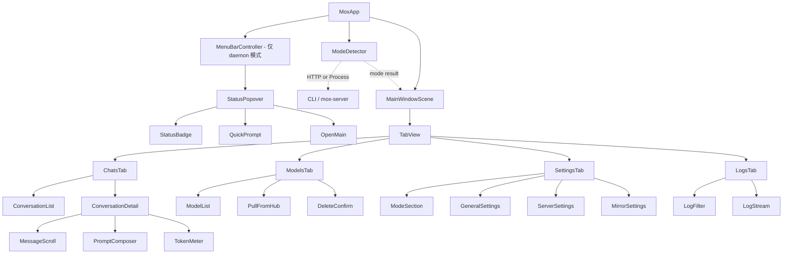

# MoxGUI 设计草案 v0.1

**状态：** 待评审草案。
**目标：** macOS .app，把 MoxCore 的模型/运行时管理跟原生聊天体验结合，规模对标 Docker Desktop / Ollama / LM Studio。

---

## 1. 形态：CLI / daemon 两种模式由用户场景决定

CLI 模式（daemonless）跑 `mox pull / list / delete / run / chat / -m`，零后台进程。daemon 模式 `mox-server install` 注册 launchd，常驻后台监听端口供 UI / 第三方工具走 HTTP。**同一份 MoxCore / MoxServer / MoxShared 库**被三个可执行目标链接：

| 产物 | 角色 | 用户是否看到 |
| --- | --- | --- |
| `mox` | 手动 CLI | 是 |
| `mox-server` | daemon 控制 + 服务端（install / start / stop / status / logs / uninstall） | 仅 launchd 和 MoxGUI spawn 时用 |
| `Mox.app` | SwiftUI GUI 客户端 | 是 |

**进程拓扑**：

- CLI 模式：`mox chat ──> MoxCore (in-process actor) ──> MLX`
- daemon 模式：`Mox.app ──HTTP──> mox-server (launchd 监管) ──> MoxCore (actor) ──> MLX`

**MoxGUI 启动流程**：读 `~/.mox/config.json` 的 `daemon.enabled` → 探测 `127.0.0.1:<port>` 的 `/health` → 决策树：daemon 在跑就连上；daemon 没在 + enabled=false → 临时模式；daemon 没在 + enabled=true → 弹 dialog 三选一（启动 daemon / 用临时模式 / 取消）。

**临时模式 history 管理**：MoxGUI 持 history（持久化在 `~/Library/Application Support/Mox/conversations.sqlite`），mox 是 stateless 推理后端——每次 `mox chat --messages <json> --stream` 子进程调用带完整 message history。`MoxCore` 库不动，`mox chat` 只在 CLI 层加 `--messages` 参数和 stdout OpenAI chunk 流输出。

**两种模式对比**：

| | daemon 模式 | 临时模式 |
| --- | --- | --- |
| 启动开销 | 0 | ~300ms Metal init / 轮 |
| 长 history prefill | 1 次 | 每轮 1 次（重复） |
| 菜单栏 popover | ✅ | ❌ |
| 第三方 OpenAI 客户端 | ✅ | ❌ |
| 后台持续推理 | ✅ | ❌ |

**配置** `~/.mox/config.json`：

```json
{
  "version": 1,
  "server": { "host": "127.0.0.1", "port": 11555 },
  "daemon": { "enabled": false },
  "defaults": { "maxTokens": 2048, "temperature": 0.7, "topP": 0.9 }
}
```

`daemon.enabled` 单一字段：`true` 期望有 daemon（不在则弹 dialog）、`false` 临时模式（不弹 dialog）、缺字段等同 `false`。`mox-server install` 写 `enabled=true` + plist；`mox-server uninstall` 写 `enabled=false` + 删 plist。

**模式切换**：false→true 立即 spawn `mox-server start` 试启（启不上回滚）；true→false 立即 `mox-server stop`（不留 daemon 孤儿进程）。

**launchd plist** `~/Library/LaunchAgents/com.mox.server.plist`：

```xml
<?xml version="1.0" encoding="UTF-8"?>
<plist version="1.0">
<dict>
    <key>Label</key><string>com.mox.server</string>
    <key>ProgramArguments</key>
    <array>
        <string>/usr/local/bin/mox-server</string>
        <string>daemon</string>
        <string>--port</string>
        <string>11555</string>
    </array>
    <key>RunAtLoad</key><true/>
    <key>KeepAlive</key><true/>
    <key>StandardOutPath</key><string>~/Library/Logs/Mox/daemon.log</string>
    <key>StandardErrorPath</key><string>~/Library/Logs/Mox/daemon.err</string>
</dict>
</plist>
```

路径按 `uname -m` 选：Intel `/usr/local/bin`、Apple Silicon `/opt/homebrew/bin`。

**拉模型**（v0.3 不加 `/v1/pull` 路由）：两种模式都走临时模式子进程——MoxGUI spawn `mox pull <id>`，读 stdout 解析进度 JSON。拉完调 `GET /v1/models` 刷新。低频、重量级操作不值得加 HTTP 路由。

**二进制发现**：MoxGUI 找 `mox` / `mox-server` 优先级 `/usr/local/bin` → `/opt/homebrew/bin` → `$(brew --prefix mox)/bin` → bundle 内 `Resources/`。MoxGUI bundle **只放 `mox-server`**，`mox` 应系统装。

**协议对齐**：所有消息格式跟 OpenAI ChatCompletionRequest/Response 兼容（`MoxShared.Models` 已定义）。`config.json` 的 `version` 字段做版本协商。

**v0.3 实现清单**（3-4 天）：

| 工作项 | 工作量 |
| --- | --- |
| Package.swift 拆 target：新增 `MoxServerCLI`（`mox-server` binary） | 1 小时 |
| `MoxServerCLI` 入口：`daemon` / `install` / `uninstall` / `start` / `stop` / `status` / `logs` | 半天 |
| launchd plist 写入 + `launchctl` 封装（uname -m 选路径） | 半天 |
| `MoxCLI` 加 `--messages <json>` + stdout OpenAI chunk 流 | 1 小时 |
| `MoxAPIClient` 协议 + `HTTPAPIClient` + `ProcessAPIClient` | 半天 |
| `MoxGUI` target 骨架（SwiftUI App + 4 tab + 菜单栏） | 1 天 |
| `MoxGUI` 启动流程（探测 + dialog + 临时模式 fallback） | 半天 |
| `MoxGUI` Settings UI 加运行模式 section | 1 小时 |
| MoxGUI 通过 `Process` 启 mox / mox-server，stdout 解析 | 半天 |
| `mox debug` 子命令（**仅 debug build**） | 1 小时 |

**MoxCore / MoxServer / MoxShared 库完全不动**——所有改动在新 target、CLI 参数、`mox debug`。

---

## 2. 主窗口结构

```
┌──────────────────────────────────────────────────────────────┐
│  Mox                                       ⚙ 设置    ⌘N 新建 │
├──────────────────────────────────────────────────────────────┤
│ [ 💬 对话 ]  [ 📦 模型 ]  [ ⚙ 设置 ]  [ 📋 日志 ]            │
├──────────────┬───────────────────────────────────────────────┤
│  + 新对话    │  Qwen2.5-0.5B-Instruct  ● 已加载              │
│  ▸ 最新      │  用户：写一首关于 Swift 并发的俳句。          │
│  ▸ 调试      │  助手：▌（token 流式输出）                    │
│  搜索...     │  [ 输入消息...                       ⌘↩ 发送 ] │
└──────────────┴───────────────────────────────────────────────┘
```

macOS 14+ SwiftUI `TabView`：**对话** / **模型** / **设置** / **日志**。临时模式下不注册菜单栏图标（无常驻进程）。

---

## 3. 视图层级



---

## 4. 关键交互流

**拉模型**（两种模式都走临时模式子进程）：

```
模型 tab → "添加模型" → Sheet
  → 源选择器 + org/name 输入
  → ⌘↩ 拉取
  → MoxGUI spawn `mox pull <id>` 子进程
  → 读 stdout 解析进度 JSON
  → 行内进度条
  → 调 GET /v1/models 刷新
```

**聊天**（daemon 模式）：`POST /v1/chat/completions {stream: true}` (SSE)，流式期间输入框禁用，⎋ 取消。
**聊天**（临时模式）：spawn `mox chat --model <id> --messages <history.json> --stream` 子进程，读 stdout OpenAI chunk JSON，⎋ → kill 子进程。

**统一接口** `MoxAPIClient` 协议：

```swift
protocol MoxAPIClient {
    func chat(modelId: String, messages: [ChatMessage], stream: Bool) async throws -> AsyncStream<String>
    func listModels() async throws -> [ModelInfo]
    func cancelChat() async throws
}
```

- `HTTPAPIClient` — daemon 模式，URLSession
- `ProcessAPIClient` — 临时模式，`Process()` + stdout

`pullModel` **不放在协议里**——MoxGUI 拉模型直接 `Process.run("mox", ["pull", id])`（§1 决策）。

---

## 5. 流式 token 渲染

`MoxAPIClient.chat()` 返回 `AsyncStream<String>`。`ConversationDetail` 持有当前助手轮 `ChatMessage.content`，每 chunk 追加，SwiftUI `@Observable` 重渲染当前消息气泡。已渲染历史不重绘。

**思考过程**（Qwen3 / DeepSeek-R1 的 <think> 段）**默认折叠**——只显示最终回答。开关可切显示。v0.3 用正则识别 `<think>...</think>` 段。

**v0.3 不做 Markdown 渲染**——v0.4 加 `AttributedString` 解析。

---

## 6. 并发模型

- **daemon 模式**：`MoxGUI (MainActor) → URLSession → mox-server (NIO HTTP) → MoxCore actors → MLX`
- **临时模式**：`MoxGUI (MainActor) → Process → mox chat 子进程 (MoxCore actors) → MLX`

临时模式下 mox chat 是子进程，`MoxCore` 不在 MoxGUI 进程内——MoxGUI 不 import MoxCore。

---

## 7. 持久化

| 内容 | 位置 |
| --- | --- |
| 对话历史 | `~/Library/Application Support/Mox/conversations.sqlite` |
| 设置 | `~/.mox/config.json` |
| 日志 | `~/Library/Logs/Mox/<date>.log` |
| 模型 | `~/.mox/models/<id>/`（不变） |
| launchd plist | `~/Library/LaunchAgents/com.mox.server.plist` |

**SQLite + GRDB.swift**——SwiftData 跟 Mox 场景不匹配（MoxGUI 不读本地 SQLite，`@Query` 优势用不到；Core Data store 跨进程不能；debug 阶段 SwiftData store 文件有 `Z_*` metadata 表反而难读）。

**表设计**：

```sql
CREATE TABLE conversations (
    id TEXT PRIMARY KEY,
    title TEXT NOT NULL,
    model_id TEXT NOT NULL,
    created_at INTEGER NOT NULL,
    updated_at INTEGER NOT NULL
);
CREATE INDEX idx_conv_updated ON conversations(updated_at DESC);

CREATE TABLE messages (
    id TEXT PRIMARY KEY,
    conversation_id TEXT NOT NULL REFERENCES conversations(id) ON DELETE CASCADE,
    role TEXT NOT NULL,
    content TEXT NOT NULL,
    token_count INTEGER,
    created_at INTEGER NOT NULL
);
CREATE INDEX idx_msg_conv_time ON messages(conversation_id, created_at);
```

**v0.3 不加 FTS5 全文搜索**——schema 简洁优先。v0.5 评估。

**调试**：release 包无 debug UI，开发者用 `sqlite3` CLI 直接查 db；`mox debug` 子命令（仅 debug build）提供 `db schema` / `db shell` / `db dump <id>` / `db list` / `db search` / `models` / `daemon` / `open-data-dir` 等便利封装。

---

## 8. 分发与沙箱

**分发**：v0.3 源码发布（`git clone && swift build`）。v0.5 加 Developer ID + 公证 + `.dmg` / Homebrew tap。

**沙箱策略**：

- **v0.3 不做沙箱**。原因：macOS App Sandbox 需要 code signing + Hardened Runtime + 公证流程，开发摩擦大。威胁模型看 Mox 拉模型已有三层防御（path traversal guard、mirror 白名单、SHA-256 校验）足够。MLX 加载不可信权重是真实风险但 v0.3 接受。
- **v0.5 加 Mac App Sandbox**——跟 code signing + 公证一起做。沙箱配置文件 `Mox.entitlements`：允许下载文件到 `~/Library/Caches/Mox/`、允许 mmap 到 unified memory、禁止访问其他目录、网络出站白名单（只允许 HF/ModelScope host）。
- **v0.5+ 评估 apple/container**。apple/container（Swift 写的 OCI 运行时 + Virtualization.framework）做"拉模型/加载模型"在 Linux VM 里的隔离是理论上**最干净**的沙箱：拉取 + 解析 + 加载都在 VM 里，VM 边界隔离 Metal shader 漏洞、malformed safetensors RCE 风险。**v0.3 不集成**——启动 3-8s + Linux 上无 Metal 只能 CPU 加载（几 GB 几十秒），用户能感觉到；当前 threat model 不到 v0.3 必须的程度。v0.5 重新评估时如果用户量起来 + 看到真攻击场景，再加。

**Mac App Sandbox vs apple/container 区别**：

- **Mac App Sandbox** = macOS 内核 syscall 限制（不能访问未声明路径、不能出站未授权网络）——MoxGUI 跟 macOS 系统边界
- **apple/container** = 完整 Linux VM 隔离（hypervisor 强隔离 + 自己的 kernel）——Mox 拉模型/加载跟 host macOS 边界
- v0.5 一起做：App Sandbox 走 macOS 标准、apple/container 走 VM 隔离（条件性启用）

---

## 9. v0.3 不做什么

- 多模态输入 / Function calling UI / RAG / 知识库
- iOS / iPadOS 客户端
- 遥测 / 插件系统
- `/v1/pull` HTTP 路由
- apple/container 集成（v0.5 评估）
- Mac App Sandbox + Hardened Runtime（v0.5）
- SwiftData
- `mox debug` 子命令暴露给 release
- Markdown 渲染（v0.4）
- FTS5 全文搜索（v0.5 评估）

---

## 10. v0.3 决策记录

- **Markdown 渲染**：v0.3 纯文本，v0.4 加 AttributedString（§5）
- **FTS5**：v0.3 不加（§7）
- **思考过程 UI**：v0.3 默认折叠 + 开关可切（§5）
- **拉模型走子进程**：daemon 模式也走临时模式子进程，不加 `/v1/pull`（§1）
- **临时模式 history**：MoxGUI 持，mox 是 stateless（§1）
- **Mac App Sandbox**：v0.3 不做，v0.5 一起上
- **apple/container**：v0.3 不集成，v0.5+ 评估
- **SwiftData**：不用——场景不匹配 + debug 不便
- **Settings 用 tab 还是 ⌘, 窗口**：tab
- **布局 tabs vs 单流**：4 tabs
