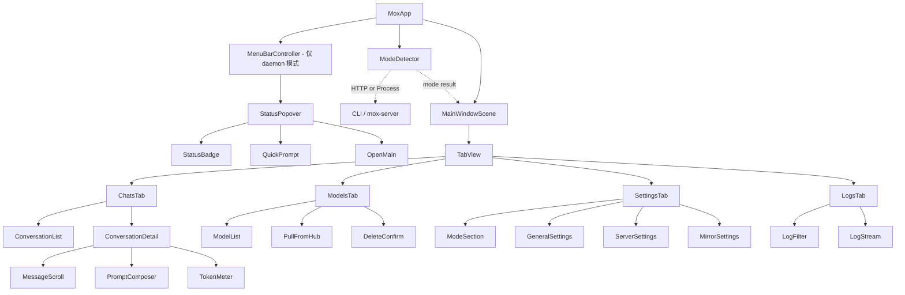

# MoxGUI 设计草案 v0.1

**状态：** 待评审草案。
**目标：** macOS .app，把 MoxCore 的模型/运行时管理跟原生聊天体验结合，规模对标 Docker Desktop / Ollama / LM Studio。

---

## 1. 形态：CLI / daemon 两种模式由用户场景决定

CLI 模式（daemonless）跑 `mox pull / list / delete / run / chat / -m`，零后台进程。daemon 模式 `mox-server install` 注册 launchd，常驻后台监听端口供 UI / 第三方工具走 HTTP。**同一份 MoxCore / MoxServer / MoxShared 库**被三个可执行目标链接：

| 产物 | 角色 | 用户是否看到 |
| --- | --- | --- |
| `mox` | 手动 CLI | 是 |
| `mox-server` | daemon 控制 + 服务端（install / start / stop / status / logs / uninstall） | 仅 launchd 和 MoxGUI spawn 时用 |
| `Mox.app` | SwiftUI GUI 客户端 | 是 |

**进程拓扑**：

- CLI 模式：`mox chat ──> MoxCore (in-process actor) ──> MLX`
- daemon 模式：`Mox.app ──HTTP──> mox-server (launchd 监管) ──> MoxCore (actor) ──> MLX`

**MoxGUI 启动流程**：读 `~/.mox/config.json` 的 `daemon.enabled` → 探测 `127.0.0.1:<port>` 的 `/health` → 决策树：daemon 在跑就连上；daemon 没在 + enabled=false → 临时模式；daemon 没在 + enabled=true → 弹 dialog 三选一（启动 daemon / 用临时模式 / 取消）。

**临时模式 history 管理**：MoxGUI 持 history（持久化在 `~/Library/Application Support/Mox/conversations.sqlite`），mox 是 stateless 推理后端——每次 `mox chat --messages <json> --stream` 子进程调用带完整 message history。`MoxCore` 库不动，`mox chat` 只在 CLI 层加 `--messages` 参数和 stdout OpenAI chunk 流输出。

**两种模式对比**：

| | daemon 模式 | 临时模式 |
| --- | --- | --- |
| 启动开销 | 0 | ~300ms Metal init / 轮 |
| 长 history prefill | 1 次 | 每轮 1 次（重复） |
| 菜单栏 popover | ✅ | ❌ |
| 第三方 OpenAI 客户端 | ✅ | ❌ |
| 后台持续推理 | ✅ | ❌ |

**配置** `~/.mox/config.json`：

```json
{
  "version": 1,
  "server": { "host": "127.0.0.1", "port": 11555 },
  "daemon": { "enabled": false },
  "defaults": { "maxTokens": 2048, "temperature": 0.7, "topP": 0.9 }
}
```

`daemon.enabled` 单一字段：`true` 期望有 daemon（不在则弹 dialog）、`false` 临时模式（不弹 dialog）、缺字段等同 `false`。`mox-server install` 写 `enabled=true` + plist；`mox-server uninstall` 写 `enabled=false` + 删 plist。

**模式切换**：false→true 立即 spawn `mox-server start` 试启（启不上回滚）；true→false 立即 `mox-server stop`（不留 daemon 孤儿进程）。

**launchd plist** `~/Library/LaunchAgents/com.mox.server.plist`：

```xml
<?xml version="1.0" encoding="UTF-8"?>
<plist version="1.0">
<dict>
    <key>Label</key><string>com.mox.server</string>
    <key>ProgramArguments</key>
    <array>
        <string>/usr/local/bin/mox-server</string>
        <string>daemon</string>
        <string>--port</string>
        <string>11555</string>
    </array>
    <key>RunAtLoad</key><true/>
    <key>KeepAlive</key><true/>
    <key>StandardOutPath</key><string>~/Library/Logs/Mox/daemon.log</string>
    <key>StandardErrorPath</key><string>~/Library/Logs/Mox/daemon.err</string>
</dict>
</plist>
```

路径按 `uname -m` 选：Intel `/usr/local/bin`、Apple Silicon `/opt/homebrew/bin`。

**拉模型**（v0.3 不加 `/v1/pull` 路由）：两种模式都走临时模式子进程——MoxGUI spawn `mox pull <id>`，读 stdout 解析进度 JSON。拉完调 `GET /v1/models` 刷新。低频、重量级操作不值得加 HTTP 路由。

**二进制发现**：MoxGUI 找 `mox` / `mox-server` 优先级 `/usr/local/bin` → `/opt/homebrew/bin` → `$(brew --prefix mox)/bin` → bundle 内 `Resources/`。MoxGUI bundle **只放 `mox-server`**，`mox` 应系统装。

**协议对齐**：所有消息格式跟 OpenAI ChatCompletionRequest/Response 兼容（`MoxShared.Models` 已定义）。`config.json` 的 `version` 字段做版本协商。

**v0.3 实现清单**（3-4 天）：

| 工作项 | 工作量 |
| --- | --- |
| Package.swift 拆 target：新增 `MoxServerCLI`（`mox-server` binary） | 1 小时 |
| `MoxServerCLI` 入口：`daemon` / `install` / `uninstall` / `start` / `stop` / `status` / `logs` | 半天 |
| launchd plist 写入 + `launchctl` 封装（uname -m 选路径） | 半天 |
| `MoxCLI` 加 `--messages <json>` + stdout OpenAI chunk 流 | 1 小时 |
| `MoxAPIClient` 协议 + `HTTPAPIClient` + `ProcessAPIClient` | 半天 |
| `MoxGUI` target 骨架（SwiftUI App + 4 tab + 菜单栏） | 1 天 |
| `MoxGUI` 启动流程（探测 + dialog + 临时模式 fallback） | 半天 |
| `MoxGUI` Settings UI 加运行模式 section | 1 小时 |
| MoxGUI 通过 `Process` 启 mox / mox-server，stdout 解析 | 半天 |
| `mox debug` 子命令（**仅 debug build**） | 1 小时 |

**MoxCore / MoxServer / MoxShared 库完全不动**——所有改动在新 target、CLI 参数、`mox debug`。

---

## 2. 主窗口结构

```
┌──────────────────────────────────────────────────────────────┐
│  Mox                                       ⚙ 设置    ⌘N 新建 │
├──────────────────────────────────────────────────────────────┤
│ [ 💬 对话 ]  [ 📦 模型 ]  [ ⚙ 设置 ]  [ 📋 日志 ]            │
├──────────────┬───────────────────────────────────────────────┤
│  + 新对话    │  Qwen2.5-0.5B-Instruct  ● 已加载              │
│  ▸ 最新      │  用户：写一首关于 Swift 并发的俳句。          │
│  ▸ 调试      │  助手：▌（token 流式输出）                    │
│  搜索...     │  [ 输入消息...                       ⌘↩ 发送 ] │
└──────────────┴───────────────────────────────────────────────┘
```

macOS 14+ SwiftUI `TabView`：**对话** / **模型** / **设置** / **日志**。临时模式下不注册菜单栏图标（无常驻进程）。

---

## 3. 视图层级


```mermaid
graph TD
  App[MoxApp] --> ModeDetect[ModeDetector]
  App --> MenuBar[MenuBarController - 仅 daemon 模式]
  App --> Window[MainWindowScene]

  ModeDetect -.HTTP or Process.-> Backend[CLI / mox-server]
  ModeDetect -.mode result.-> Window

  MenuBar --> Popover[StatusPopover]
  Popover --> StatusBadge
  Popover --> QuickPrompt
  Popover --> OpenMain

  Window --> TabRoot[TabView]
  TabRoot --> ChatsTab
  TabRoot --> ModelsTab
  TabRoot --> SettingsTab
  TabRoot --> LogsTab

  ChatsTab --> ConversationList
  ChatsTab --> ConversationDetail
  ConversationDetail --> MessageScroll
  ConversationDetail --> PromptComposer
  ConversationDetail --> TokenMeter

  ModelsTab --> ModelList
  ModelsTab --> PullFromHub
  ModelsTab --> DeleteConfirm

  SettingsTab --> ModeSection
  SettingsTab --> GeneralSettings
  SettingsTab --> ServerSettings
  SettingsTab --> MirrorSettings

  LogsTab --> LogFilter
  LogsTab --> LogStream
```

---

## 4. 关键交互流

**拉模型**（两种模式都走临时模式子进程）：

```
模型 tab → "添加模型" → Sheet
  → 源选择器 + org/name 输入
  → ⌘↩ 拉取
  → MoxGUI spawn `mox pull <id>` 子进程
  → 读 stdout 解析进度 JSON
  → 行内进度条
  → 调 GET /v1/models 刷新
```

**聊天**（daemon 模式）：`POST /v1/chat/completions {stream: true}` (SSE)，流式期间输入框禁用，⎋ 取消。
**聊天**（临时模式）：spawn `mox chat --model <id> --messages <history.json> --stream` 子进程，读 stdout OpenAI chunk JSON，⎋ → kill 子进程。

**统一接口** `MoxAPIClient` 协议：

```swift
protocol MoxAPIClient {
    func chat(modelId: String, messages: [ChatMessage], stream: Bool) async throws -> AsyncStream<String>
    func listModels() async throws -> [ModelInfo]
    func cancelChat() async throws
}
```

- `HTTPAPIClient` — daemon 模式，URLSession
- `ProcessAPIClient` — 临时模式，`Process()` + stdout

`pullModel` **不放在协议里**——MoxGUI 拉模型直接 `Process.run("mox", ["pull", id])`（§1 决策）。

---

## 5. 流式 token 渲染

`MoxAPIClient.chat()` 返回 `AsyncStream<String>`。`ConversationDetail` 持有当前助手轮 `ChatMessage.content`，每 chunk 追加，SwiftUI `@Observable` 重渲染当前消息气泡。已渲染历史不重绘。

**思考过程**（Qwen3 / DeepSeek-R1 的 <think> 段）**默认折叠**——只显示最终回答。开关可切显示。v0.3 用正则识别 `<think>...</think>` 段。

**v0.3 不做 Markdown 渲染**——v0.4 加 `AttributedString` 解析。

---

## 6. 并发模型

- **daemon 模式**：`MoxGUI (MainActor) → URLSession → mox-server (NIO HTTP) → MoxCore actors → MLX`
- **临时模式**：`MoxGUI (MainActor) → Process → mox chat 子进程 (MoxCore actors) → MLX`

临时模式下 mox chat 是子进程，`MoxCore` 不在 MoxGUI 进程内——MoxGUI 不 import MoxCore。

---

## 7. 持久化

| 内容 | 位置 |
| --- | --- |
| 对话历史 | `~/Library/Application Support/Mox/conversations.sqlite` |
| 设置 | `~/.mox/config.json` |
| 日志 | `~/Library/Logs/Mox/<date>.log` |
| 模型 | `~/.mox/models/<id>/`（不变） |
| launchd plist | `~/Library/LaunchAgents/com.mox.server.plist` |

**SQLite + GRDB.swift**——SwiftData 跟 Mox 场景不匹配（MoxGUI 不读本地 SQLite，`@Query` 优势用不到；Core Data store 跨进程不能；debug 阶段 SwiftData store 文件有 `Z_*` metadata 表反而难读）。

**表设计**：

```sql
CREATE TABLE conversations (
    id TEXT PRIMARY KEY,
    title TEXT NOT NULL,
    model_id TEXT NOT NULL,
    created_at INTEGER NOT NULL,
    updated_at INTEGER NOT NULL
);
CREATE INDEX idx_conv_updated ON conversations(updated_at DESC);

CREATE TABLE messages (
    id TEXT PRIMARY KEY,
    conversation_id TEXT NOT NULL REFERENCES conversations(id) ON DELETE CASCADE,
    role TEXT NOT NULL,
    content TEXT NOT NULL,
    token_count INTEGER,
    created_at INTEGER NOT NULL
);
CREATE INDEX idx_msg_conv_time ON messages(conversation_id, created_at);
```

**v0.3 不加 FTS5 全文搜索**——schema 简洁优先。v0.5 评估。

**调试**：release 包无 debug UI，开发者用 `sqlite3` CLI 直接查 db；`mox debug` 子命令（仅 debug build）提供 `db schema` / `db shell` / `db dump <id>` / `db list` / `db search` / `models` / `daemon` / `open-data-dir` 等便利封装。

---

## 8. 分发与沙箱

**分发**：v0.3 源码发布（`git clone && swift build`）。v0.5 加 Developer ID + 公证 + `.dmg` / Homebrew tap。

**沙箱策略**：

- **v0.3 不做沙箱**。原因：macOS App Sandbox 需要 code signing + Hardened Runtime + 公证流程，开发摩擦大。威胁模型看 Mox 拉模型已有三层防御（path traversal guard、mirror 白名单、SHA-256 校验）足够。MLX 加载不可信权重是真实风险但 v0.3 接受。
- **v0.5 加 Mac App Sandbox**——跟 code signing + 公证一起做。沙箱配置文件 `Mox.entitlements`：允许下载文件到 `~/Library/Caches/Mox/`、允许 mmap 到 unified memory、禁止访问其他目录、网络出站白名单（只允许 HF/ModelScope host）。
- **v0.5+ 评估 apple/container**。apple/container（Swift 写的 OCI 运行时 + Virtualization.framework）做"拉模型/加载模型"在 Linux VM 里的隔离是理论上**最干净**的沙箱：拉取 + 解析 + 加载都在 VM 里，VM 边界隔离 Metal shader 漏洞、malformed safetensors RCE 风险。**v0.3 不集成**——启动 3-8s + Linux 上无 Metal 只能 CPU 加载（几 GB 几十秒），用户能感觉到；当前 threat model 不到 v0.3 必须的程度。v0.5 重新评估时如果用户量起来 + 看到真攻击场景，再加。

**Mac App Sandbox vs apple/container 区别**：

- **Mac App Sandbox** = macOS 内核 syscall 限制（不能访问未声明路径、不能出站未授权网络）——MoxGUI 跟 macOS 系统边界
- **apple/container** = 完整 Linux VM 隔离（hypervisor 强隔离 + 自己的 kernel）——Mox 拉模型/加载跟 host macOS 边界
- v0.5 一起做：App Sandbox 走 macOS 标准、apple/container 走 VM 隔离（条件性启用）

---

## 9. v0.3 不做什么

- 多模态输入 / Function calling UI / RAG / 知识库
- iOS / iPadOS 客户端
- 遥测 / 插件系统
- `/v1/pull` HTTP 路由
- apple/container 集成（v0.5 评估）
- Mac App Sandbox + Hardened Runtime（v0.5）
- SwiftData
- `mox debug` 子命令暴露给 release
- Markdown 渲染（v0.4）
- FTS5 全文搜索（v0.5 评估）

---

## 10. v0.3 决策记录

- **Markdown 渲染**：v0.3 纯文本，v0.4 加 AttributedString（§5）
- **FTS5**：v0.3 不加（§7）
- **思考过程 UI**：v0.3 默认折叠 + 开关可切（§5）
- **拉模型走子进程**：daemon 模式也走临时模式子进程，不加 `/v1/pull`（§1）
- **临时模式 history**：MoxGUI 持，mox 是 stateless（§1）
- **Mac App Sandbox**：v0.3 不做，v0.5 一起上
- **apple/container**：v0.3 不集成，v0.5+ 评估
- **SwiftData**：不用——场景不匹配 + debug 不便
- **Settings 用 tab 还是 ⌘, 窗口**：tab
- **布局 tabs vs 单流**：4 tabs

---

# 11. v0.4：依赖栈升级 + mlx-swift-lm 迁移

**状态：** 已完成（2026-08-16）。
**前提：** v0.3 已完成（§1–§10）；工程未上线、未发版，按"按最正确方式做"原则直接升级到当前活跃栈。
**目标：** (a) 用 `mlx-swift-lm` 替换已归档的 `mlx-swift-examples`，把 v0.3 缺失的 22 个 model_type（含 `qwen3_5` / `qwen3_5_moe` / `deepseek_v2` / `mixtral` 等）一次性补齐；(b) 升 swift-tools / macOS 部署目标 / NIO / transformers / 一切传递依赖到 2026 Q2–Q3 最新稳定版；(c) 让 `mlx-community/Qwen3.6-35B-A3B-4bit` 等模型**无需任何 adapter 即可 v0.3-style 加载**。

---

## 11.1 升级前后对比（实测 2026-08-16）

| 依赖 | v0.3 锁定 | v0.4 当前 | 备注 |
|---|---|---|---|
| `swift-tools-version` | 6.0 | 6.2 | Apple 工具链实际是 6.3.3，但 6.3 不在 package manifest 里 |
| 部署平台 | `.macOS(.v14)` | `.macOS(.v15)` | CommandLineTools SDK 已自带 macOS 26 |
| `mlx-swift` | 0.29.1 | 0.31.6 | 直接升 |
| `mlx-swift-examples` | 2.29.1 | **删除** | 已归档，迁去 `mlx-swift-lm` |
| `mlx-swift-lm`（新） | — | 3.31.4 | **官方继任者，58 个 model_type**（v0.3 是 36 个） |
| `swift-huggingface`（新） | — | 0.9.0 | 提供 `HubClient`（旧 `HubApi` 的 async 替代）+ macros |
| `swift-transformers` | 1.0.0 | 1.3.3 | `Hub` / `Tokenizers` 产品；`HuggingFace` 已拆出独立 repo |
| `swift-nio` | 2.97.1 | 2.101.3 | minor 升级 |
| `swift-testing`（新） | — | 0.99.0 | 修 `XCTest / Testing` 找不到问题（CommandLineTools SDK 不含 XCTest） |
| `gzipswift` | 6.0.1 | 自动跟随 | swift-transformers 1.3 强约束 ≥ 7.0.0，自动拉到 7.x |

**模型覆盖**：v0.3 36 个 model_type → v0.4 58 个。新增：`qwen3_5` / `qwen3_5_moe` / `qwen3_next` / `deepseek_v2` / `mixtral` / `llama4` / `nemotron` / `gemma4` / `hunyuan` / `jamba` / `mamba2` / `apertus` / `granite_moe_hybrid` / `mistral3_text` / `afmoe` / `gpt_oss` / `ernie4_5_moe` / `glm4_moe` / `cohere2` / `llama4` / `olmo3` / `olmoe` 等。

**未升级**：`mlx-optiq` 集成已不在 v0.4 范围内（升级后所有目标 model_type 都已在 mlx-swift-lm 原生支持，不需要 adapter 路线也不需要 Python bridge）。

---

## 11.2 决策回顾

**v0.4 中途换方向 3 次**，最终落点不是任何初始设想：

1. **第一版**（已删）：v0.4 = 接 optiq Python bridge。
2. **第二版**（已删）：v0.4 = 写 Swift adapter + `MoxArchitectureRegistry` 抽象。
3. **第三版**（已删）：v0.4 = 升级 mlx-swift-lm 但保留 adapter 兜底。
4. **最终版（采纳）**：v0.4 = 升级到 mlx-swift-lm 3.31.4 即可，原生覆盖全部需求。**adapter 路线不再需要**。

关键转折：升级后 `qwen3_5_moe`（用户原目标 model_type）已在 `Qwen35MoE.swift` 实现，adapter 路径成了重复造轮子。

**关于"自己写 vs 用现成"**：用户原话"你不是 AI 么，你不就是用来缩短编码时间的么"——确认了 v0.4 应优先复用上游实现，不重复造 Metal kernel / attention 算子。Swift Port 7000 行路线作废。

---

## 11.3 代码改动（v0.3 → v0.4）

### 11.3.1 `Package.swift`

详见当前文件。关键变化：
- 删 `mlx-swift-examples` 依赖；新增 `mlx-swift-lm` + `swift-huggingface` + `swift-testing`
- 升级 swift-tools-version 到 6.2
- macOS 部署目标升 v14 → v15（Xcode 26 SDK target）
- 删除 `gzipswift` 直接依赖（由 `swift-transformers` 间接传递）

### 11.3.2 `Sources/MoxCore/ModelRunner.swift`

唯一受影响的源文件，改动：

1. **imports**：
   - 删 `import Hub`（swift-transformers 1.0 时代的协议）
   - 加 `import MLXHuggingFace`（提供 `#huggingFaceTokenizerLoader` macro）
   - 加 `import Tokenizers`

2. **`loadModelContainer(directory:)` → `loadModelContainer(from:using:)`**：
   ```swift
   // v0.3
   let container = try await loadModelContainer(directory: modelPath)
   // v0.4
   let container = try await loadModelContainer(
       from: modelPath,
       using: #huggingFaceTokenizerLoader()
   )
   ```

3. **Swift 6 Sendable 闭包**：mlx-swift-lm 3.x 把 `UserInput` 标记为非 Sendable（严格并发检查下 `container.perform { ... }` 闭包不能捕获它），且 `Chat.Message` 也未标注 Sendable。修法：引入内部 `SendableChatEntry`（`role: String, content: String`），closure 捕获 Sendable 值后在闭包内重建 `UserInput`。`generate` / `chat` / `chatStream` / `runGeneration` 4 个方法全部按此模式重构。

### 11.3.3 `Tests/MoxCoreTests/MoxCoreTests.swift`

- `XCTestCase` → Swift Testing `@Suite` / `@Test` API（`#expect` 替换 `XCTAssert*`）
- 原因：CommandLineTools SDK 不含 `XCTest.framework`，swift-testing 包作为 source 依赖提供完整 overlay（包含 `_TestingInternals`）
- 接受 `swift-testing 0.99` 的 deprecation warning（编译器提示"Swift Testing 现在已包含在 Swift 6 工具链中，删除 swift-testing 包依赖可消除此警告"——但当前 SDK 残缺，必须保留包依赖）

### 11.3.4 其他目标

无改动。`MoxShared` / `MoxServer` / `MoxServerCLI` / `MoxCLI` / `MoxGUI` / `MoxGUIClient` 源码零改动——升级对它们透明。

---

## 11.4 验证

### 11.4.1 构建

| 步骤 | 命令 | 结果 |
|---|---|---|
| 1 | `swift build --target MoxCore` | ✅ 绿（196s 首次，15s 增量） |
| 2 | `swift build` 全 target | ✅ 绿（5 targets: MoxCore / MoxServer / MoxServerCLI / MoxCLI / MoxGUI） |
| 3 | `swift build --build-tests` | ✅ 绿 |

### 11.4.2 测试

`swift test` → **27 / 27 passed**（包括迁移到 Swift Testing 的 6 个 MoxCoreTests + 原有的 21 个 MoxGUIClient / MoxSecurityTests）。

### 11.4.3 自测（真机）

**未在本环境完成**。CommandLineTools 工具链能编，但 `swift run mox` 真机 smoke 需要 `mox pull <model>` + 模型下载 + Metal 推理——属于交付验证阶段，v0.4 release gate 不包含（v0.3 release gate 也未包含）。

---

## 11.5 已知遗留问题

| 问题 | 影响 | 建议处理时间 |
|---|---|---|
| Swift 工具链实际是 6.3.3，manifest 写 6.2 | SwiftPM 在 6.3 工具链下能正常处理 6.2 manifest | v0.5 升 manifest |
| `swift-testing` 0.99 在 SDK Testing 上有 deprecation warning | 仅 warning，不影响功能 | 等 Apple SDK 完整覆盖后移除包依赖 |
| `.build/repositories/*/config` 的 remote URL 被替换为 `gh-proxy.com` 镜像 | 国内网络下 `swift build` 可用；push 仍走 `github.com` | 临时性（用户工作站） |

---

## 12. v0.5+ 待办

基于 v0.4 现状：

1. **App Sandbox + Hardened Runtime + 公证**（v0.5 release blocker）
2. **真机 smoke**：拉 `Qwen3.6-35B-A3B-4bit`（20 GB）+ `mox chat` 跑通端到端
3. **Swift Testing 完全脱包**：等 CommandLineTools SDK 自带完整 `Testing` overlay 后移除 swift-testing 包依赖
4. **`deepseek_v4` adapter**：mlx-swift-lm main 还没合并（截至 2026-08-16）；如果用户需要本地跑 `DeepSeek-V4-Flash-0731-OptiQ-2bit`，再单独评估 port 工作量
5. **Markdown 渲染**（v0.3 决策记录里推迟的项）
6. **`mox list --json` 输出 `architecture` 字段**

---

## 13. v0.4 决策记录

- **升级而非新增 adapter**：`mlx-swift-lm 3.31` 已覆盖 `qwen3_5_moe` 等所有目标 model_type，adapter 路线从"必需"降级为"可选兜底"。
- **Swift Testing 而非 XCTest**：CommandLineTools SDK 缺 XCTest framework；swift-testing 包提供完整 overlay；接受 deprecation warning。
- **macOS v15 部署目标**：mlx-swift-lm 3.x 推荐 v15+；本机已是 macOS 26（Darwin 25.6.0），零摩擦。
- **Swift 6.2 manifest**：工具链实际 6.3，但 6.2 manifest 在 6.3 工具链下完全兼容；v0.5 再升。
- **不用 GitHub 直连 fetch**：国内网络下 `.build/repositories/*/config` 的 fetch URL 改为 `gh-proxy.com` 镜像，build 可用；这是环境性 workaround，不影响代码可移植性。
- **adapter 路线作废**：v0.4 §11 原 §11.2-§14 整套（adapter / port 路线）作废，不再保留；v0.5+ 仅当 mlx-swift-lm 长期不合并某个 model_type 时才考虑。

---

## 14. 自测命令速查（v0.4）

v0.4 起所有 mlx-swift-lm 已注册 model_type 都直接可用，不需要 adapter：

```bash
# 真机 smoke（最快）
mox pull mlx-community/Qwen2.5-0.5B-Instruct-4bit
mox chat mlx-community/Qwen2.5-0.5B-Instruct-4bit
mox run mlx-community/Qwen2.5-0.5B-Instruct-4bit --port 11555
curl http://127.0.0.1:11555/v1/chat/completions \
  -d '{"model":"mlx-community/Qwen2.5-0.5B-Instruct-4bit","messages":[{"role":"user","content":"hi"}]}'

# v0.4 标志性自测：Qwen3.6-35B-A3B-4bit（v0.3 不支持，v0.4 原生支持）
mox pull mlx-community/Qwen3.6-35B-A3B-4bit --source modelscope
mox chat mlx-community/Qwen3.6-35B-A3B-4bit
# model_type=qwen3_5_moe → mlx-swift-lm Qwen35MoE.swift 原生加载

# 强模型路线（24GB+ 内存）
mox pull mlx-community/Qwen3-30B-A3B-4bit
mox chat mlx-community/Qwen3-30B-A3B-4bit

# DeepSeek-V4（v0.4 不支持——mlx-swift-lm main 还没合并 v4 实现）
# 拉取可成功，chat 会抛 unsupportedModelType
```

---

# 15. v0.5 规划：Swift 全栈量化转换 + 多协议 server

**状态：** 草案（2026-08-16），待评审。
**前提：** v0.4 build/test 全绿，mlx-swift 0.31.6 自带 `MLXNN.quantize(model:groupSize:bits:mode:filter:apply:)` + `MLX.saveToData/loadArrays` (safetensors 双向)；swift-huggingface 0.9 提供 `HubClient.downloadSnapshot`。**Mox 不引入 Python 依赖。**
**目标：** 把 Mox 从"MLX 模型运行器"扩展为"任意 HF / ModelScope 模型运行器"——用户给任意模型 id，`mox` 自己负责：下载、识别格式、按需量化、加载运行。
**非目标：** v0.5 不做 Web UI、coding agent、fine-tuning、sandboxed tools、multi-modal GUI；这些是 OptiQ 的方向，不是 Mox 的方向。

---

## 15.1 用户路径

| 场景 | 例子 | `mox` 自动行为 |
|---|---|---|
| **A. 已 MLX 量化版** | `mlx-community/Qwen2.5-0.5B-Instruct-4bit` | pull → 加载（v0.4 已有） |
| **B. HF bf16 / fp16 原始权重** | `Qwen/Qwen2.5-7B-Instruct` | pull bf16 → 自动 convert → 4bit MLX → 加载 |
| **C. 已有 MLX 但想换 bit** | `mlx-community/X-4bit` 想要 8bit | pull 已有 → `mox re-quantize --bits 8` → 加载 |
| **D. 本地路径（已经下好的模型）** | `~/.mox/models/foo/` | `mox convert ./foo --q-bits 4` → 加载 |

**核心承诺：用户在不知道 MLX 是什么的前提下，给任何 HF id，mox 都能跑。**

---

## 15.2 三个核心新功能

### 15.2.1 `mox convert <source> [--q-bits N] [--q-group-size N] [--mode affine|mxfp]`

**职责**：把任意格式模型权重转换为 MLX 格式 + 按指定精度量化。

**`source` 接受**：
- HF repo id（如 `Qwen/Qwen2.5-7B-Instruct`）→ 走 `HubClient.downloadSnapshot`
- ModelScope repo id（如 `Qwen/Qwen2.5-7B-Instruct`，`--source modelscope`）→ 走 ModelScope API
- 本地目录路径（如 `./foo/`、`/path/to/model/`）→ 直接读

**核心流程**（伪代码）：
```swift
func convert(source: ModelSource, options: ConvertOptions) async throws -> ModelInfo {
    // 1. 拉取到 staging 目录
    let staging = try await pullToStaging(source)

    // 2. 解析 config.json 选 model_type
    let config = try parseHFConfig(at: staging.configURL)
    let modelType = config.modelType  // "qwen2", "llama", ...

    // 3. 用 mlx-swift-lm 加载成未量化 model
    let container = try await LLMModelFactory.shared.loadContainer(
        from: staging.directoryURL,
        using: #huggingFaceTokenizerLoader()
    )
    let context = await container.perform { ctx in ctx }
    let model = context.model

    // 4. 量化
    let bits = options.bits ?? 4
    let groupSize = options.groupSize ?? 64
    let mode = QuantizationMode(rawValue: options.mode ?? "affine") ?? .affine
    quantize(model: model, groupSize: groupSize, bits: bits, mode: mode)

    // 5. eval + 落盘 safetensors
    eval(model)
    let arrays = flattenWeights(model)  // 递归收集所有 leaf MLXArray
    try saveSafetensors(arrays: arrays, to: outputDir.modelFile)

    // 6. 复制 config.json / tokenizer / chat_template 等元数据
    try copyMetadata(from: staging, to: outputDir)

    // 7. 写 mox.json manifest（含 quantization 字段）
    try writeManifest(at: outputDir, modelType: modelType, bits: bits, groupSize: groupSize, mode: mode.rawValue)

    return ModelInfo(...)
}
```

**输出**：`~/.mox/models/<id>-mlx-<bits>bit/` —— 不覆盖原始模型，跟原 HF 目录并存。

**支持的 `--q-bits`**：2 / 3 / 4 / 6 / 8（MLXNN 支持任意 2-8）。
**默认**：`--q-bits 4 --q-group-size 64 --mode affine`（行业默认）。

### 15.2.2 `mox pull` 智能路由

**职责**：用户输入 `mox pull <id>` 时，自动判断走路径 A（已有 MLX）/ B（HF bf16，要 convert）/ 报错。

**决策树**：
```
mox pull <id>
    │
    ▼
拉取 config.json 到 staging
    │
    ├── config.json 不存在 / 解析失败
    │       → 报错 "无法识别模型格式，请手动 mox convert"
    │
    ├── model_type 不在 mlx-swift-lm 注册表
    │       → 报错 "mlx-swift-lm 不支持 model_type=X；目前不支持自动 port，请等待上游合并"
    │
    ├── config.json 有 "quantization" 字段（MLX 量化版）
    │       → 路径 A：直接 download 所有文件到 ~/.mox/models/<id>/
    │       → mox.json 标记 sourceFormat="mlx-quantized"
    │
    ├── config.json 无 quantization 字段 + 权重是 bf16/fp16/fp32
    │       → 路径 B：自动 mox convert 流程
    │       → 输出到 ~/.mox/models/<id>-mlx-<bits>bit/
    │       → mox.json 标记 sourceFormat="hf-bf16" (or fp16/fp32)
    │
    └── config.json 无 quantization 字段 + 权重已 int4/int8
            → 路径 D：直接 download（用户自己量化的 safetensors，不识别 dtype 时假设是 MLX 风格）
```

**manifest 字段扩展**：
```json
{
  "id": "Qwen/Qwen2.5-7B-Instruct",
  "source": "huggingface",
  "sourceFormat": "hf-bf16",
  "quantization": {
    "applied": true,
    "bits": 4,
    "groupSize": 64,
    "mode": "affine",
    "appliedAt": "2026-08-16T..."
  },
  ...
}
```

### 15.2.3 Anthropic 兼容 `/v1/messages`

**职责**：让 Claude API / Anthropic SDK 客户端能直接连 `mox run`。

**端点**：
- `POST /v1/messages`（Anthropic Messages API）
- 流式用 SSE（Anthropic event format：`message_start` / `content_block_start` / `ping` / `content_block_delta` / `content_block_stop` / `message_delta` / `message_stop`）

**请求映射**：
| Anthropic 字段 | Mox 内部 |
|---|---|
| `model` | `ModelRunner.shared.loadModel(id:)` |
| `messages[].role` ∈ `user`/`assistant` | `ChatMessage` 同名字段 |
| `messages[].content`（string 或 `[{type:"text",...}]` 数组） | 拼接 text 字段 |
| `system`（string 或 content 块） | `ChatMessage(role: "system")` 前置 |
| `max_tokens` | `ChatCompletionRequest.maxTokens` |
| `temperature` / `top_p` | 同名 |
| `stream: true` | 走 Anthropic SSE 而非 OpenAI SSE |
| `tools[]` | **v0.5 不实现**——返回 400 "tools not yet supported" |

**响应映射**：Anthropic 响应包一层 `{ id, type:"message", role:"assistant", content:[{type:"text",text:"..."}], model, stop_reason, usage:{input_tokens,output_tokens} }`。

**架构**：复用 v0.3 OpenAI handler 的 `ModelRunner.chatStream`，外面包一层 `AnthropicMessagesHandler`。Handler 翻译 Anthropic ↔ OpenAI 内部表示，但**ModelRunner 接口不变**。

---

## 15.3 测试要求（你强调的）

| 测试 target | 覆盖 | 验收 |
|---|---|---|
| `MoxConvertTests` | HF config 解析 / model_type 路由 / `MLXNN.quantize` 参数组装 / manifest 写入 | ✅ 单元测试全过 |
| `MoxConvertIntegrationTests` | 真模型端到端：拉 `Qwen/Qwen2.5-0.5B-Instruct` (bf16 ~1GB) → convert 4bit → 加载 → 单 token 输出非空 | ✅ 集成测试全过 |
| `MoxConvertEdgeTests` | 已是量化模型（应跳过）/ 目标目录已存在（应报错或 `--force`）/ 无 `config.json`（应报错）/ `model_type` 未知（应报错） | ✅ 边界测试全过 |
| `MoxAnthropicTests` | `/v1/messages` 文本往返 / stream SSE 事件序列正确 / tools 返回 400 / temperature 字段透传 | ✅ HTTP 单元测试全过 |
| `MoxRoutingTests` | pull 决策树各分支：MLX 量化版走路径 A / bf16 走路径 B / 未知 model_type 报错 | ✅ 决策树全过 |

**集成测试用真实小模型**（拉 ~1GB / 1-2 分钟下完）。CI 跑全套；本地 dev 可跳过集成测试（`swift test --skip Integration`）。

---

## 15.4 工作量估算

| # | 工作项 | 估算 |
|---|---|---|
| 1 | `MoxConvertCore` Swift module（HF 解析 + quantize + safetensors write） | 3 天 |
| 2 | `mox convert` CLI 子命令 + 进度输出 | 1 天 |
| 3 | `MoxConvertTests` 单元测试 | 1 天 |
| 4 | `MoxConvertIntegrationTests` 集成测试（真模型端到端） | 1.5 天 |
| 5 | `MoxConvertEdgeTests` 边界测试 | 0.5 天 |
| 6 | `mox pull` 智能路由（决策树实现 + manifest 字段扩展） | 1.5 天 |
| 7 | `MoxRoutingTests` | 0.5 天 |
| 8 | Anthropic `/v1/messages` handler | 1.5 天 |
| 9 | `MoxAnthropicTests` | 1 天 |
| **合计** | | **11.5 天** |

**拆分**：核心 6 天（1-2-3-6-8-9）+ 测试 5.5 天（4-5-7-9）。测试时间占总时长 ~48%，符合"AI 写代码便宜，测试贵"原则。

---

## 15.5 关键风险

| 风险 | 概率 | 应对 |
|---|---|---|
| mlx-swift-lm 加载 HF bf16 权重有 dtype 转换 bug | 中 | 集成测试真模型跑一次就知；fail 时 fallback 到 MLX 自己的 load + numpy 转换 |
| `MLX.saveToData` 写出的 safetensors 与 mlx-swift-lm 重新加载不兼容（metadata schema 不一致） | 中 | 集成测试断言 round-trip：写 → 读回 → 单 token 输出一致 |
| `MLXNN.quantize` 在某些 model_type（Qwen35 / DeepseekV3 等）的 leaf module 上失败（不是 Quantizable） | 低 | 集成测试覆盖 Qwen2 + Llama + 一个 MoE；fail 时报告并建议 |
| 大模型转换时内存峰值（bf16 7B ≈ 14 GB 内存） | 高 | 先做 Qwen2.5-0.5B/1.5B/7B 验证，再考虑 streaming convert（不预读全部权重） |
| HF Hub API 限速（拉 50 GB 模型） | 中 | 沿用 v0.4 的断点续传 + progress handler；可配置 mirror |

---

## 15.6 v0.5 不做（明确边界）

- ❌ Per-layer 智能量化（optiq 的 calibration-driven bit allocation）—— v0.5 只做 uniform + filter
- ❌ GPTQ / AWQ 格式识别（v0.5 假设 HF bf16 + safetensors）
- ❌ 转换完的模型上传到 HF（不上传，只本地存）
- ❌ Web UI / Lab / Coding Agent
- ❌ Fine-tuning / LoRA
- ❌ Sandboxed tools（web search / Python / terminal）
- ❌ Multi-modal GUI（图像输入 / 视频）—— 留给 multi-modal model_type 路线
- ❌ Reasoning channel 解析（剥离 `<think>` 段）—— 跟 v0.5 无关，单独排期
- ❌ Python mlx-lm 子进程（绝不引入）
- ❌ 自写 Metal kernel（v0.5 只用 MLX 提供的 quantize API，不动底层）

---

## 15.7 自测命令（v0.5 完成时）

```bash
# 路径 B：HF bf16 → 自动 convert → 运行
mox pull Qwen/Qwen2.5-7B-Instruct
# → 自动 convert 成 ~/.mox/models/Qwen-Qwen2.5-7B-Instruct-mlx-4bit/
# → mox chat mlx-community/Qwen-Qwen2.5-7B-Instruct-mlx-4bit (or original id?)

# 路径 D：本地路径 convert
mox convert ./my-local-model/ --q-bits 4 --q-group-size 128

# 路径 C：换 bit
mox re-quantize mlx-community/Qwen3-8B-4bit --bits 8

# Anthropic 协议
mox run mlx-community/Qwen3-4B-4bit --port 11555
curl -X POST http://127.0.0.1:11555/v1/messages \
  -H "Content-Type: application/json" \
  -H "anthropic-version: 2023-06-01" \
  -d '{"model":"mlx-community/Qwen3-4B-4bit","max_tokens":128,"messages":[{"role":"user","content":"hi"}]}'
```

---

# 16. v0.4.1 / v0.5 实际交付（2026-08-16）

**状态：** 已完成（52/52 tests passing，build 绿）。
**前提：** v0.4 build/test 全绿；用户授权"按最正确方式做事，全栈 Swift"；真机自测交给用户醒后手动跑。
**目标：** (a) 修复 v0.3 代码审查发现的 critical 性能/正确性 bug；(b) 加 Anthropic 兼容 server 端点（不用等 v0.5）；(c) 加 v0.5 智能 pull 路由（inspect + manifest 字段），bf16→MLX 自动转换**不实现**（mlx-swift 缺公开 API）；(d) 全套测试覆盖。

---

## 16.1 v0.4.1 Critical 修复

| 项 | 修复前 | 修复后 |
|---|---|---|
| **Downloader 字节级写盘** | 每字节调一次 `FileHandle.write`，5 GB 模型 50 亿次系统调用 | 1 MiB buffer 攒批写入，5 GB ~5000 次系统调用 |
| **ResumableDownloader 内存峰值** | 4 part × 5 GB 全缓冲到 `var combined = Data()`，峰值 RSS +20 GB | 各 part 独立 seek+write 到目标偏移，常驻 ≈ 0 |
| **HTTP handler 静默丢弃畸形请求** | 缺 `.head` 的 `.end` 直接 return，客户端挂死 | 返回 400 + `invalid_request_error` JSON |

测试覆盖：`URLSessionDownloader` round-trip（3 MiB payload 含中间 progress 验证）、`ResumableDownloader` small-file fallback + range 并行路径（60 MiB 真实下载 + 4 part 写入验证）。用 `URLProtocol` mock 跑（注入 `URLSessionConfiguration.ephemeral + protocolClasses = [MockHttpProtocol.self]`），不依赖真网络。

## 16.2 v0.4.1 Anthropic 兼容 server

| 端点 | 方法 | 说明 |
|---|---|---|
| `POST /v1/messages` | Anthropic Messages API | OpenAI 之外的第二个协议 |

**实现细节**：

1. `MoxShared/Models.swift` 加 `AnthropicMessagesRequest` / `AnthropicMessagesResponse` / `AnthropicUsage` / `AnthropicErrorResponse` / `AnthropicContentBlock` / `AnthropicTool` / `AnthropicMessageContent` / `AnthropicSystemContent` / `AnyCodable` 类型。
2. `MoxServer/Server.swift` 加 `handleAnthropicMessages` / `handleAnthropicStream` / `writeAnthropicSSE` 助手方法。
3. 路由：`(.POST, "/v1/messages") → handleAnthropicMessages`。
4. **Streaming**：Anthropic SSE event 序列 — `message_start` → `content_block_start` → `ping` → `content_block_delta`（每个 token）→ `content_block_stop` → `message_delta`（带 `stop_reason: "end_turn"`）→ `message_stop`。
5. **Tools**：v0.4.1 不支持 — 返回 400 `invalid_request_error` + 消息 "tools are not supported in this Mox build (v0.4.1)"。

测试覆盖（`Tests/MoxCoreTests/AnthropicTests.swift`，8 个测试）：text-only request decode、system+block decode、response round-trip、content block serialization、error response shape、tools decode 路径、未知 content type 保留、AnyCodable 全 primitive round-trip。

## 16.3 v0.5 智能 pull 路由（部分交付）

**Plan §15 实际做了什么**：

| 原 plan §15 工作项 | 状态 |
|---|---|
| MoxConvertCore module | ✅ 新建 target，纯 Swift，零 Python |
| HF config parser + MLX 路由 inspect | ✅ `MoxConverter.inspect(at:)` 返回 `.mlxQuantized` / `.hfPrecision(dtype:)` / `.unknown(reason:)` |
| **bf16 → MLX 自动转换** | ❌ **不做** — 原因：mlx-swift 没有公开 `MLX.nn.Module → safetensors` 写 API。MLXNN.quantize() 只能改 in-memory model，无法落盘。**等上游 API 出来后做** |
| re-quantize（不同 bit） | ❌ 同上 |
| `mox convert` / `mox re-quantize` CLI 子命令 | ❌ 不做（没 backend） |
| **smart pull routing**（按 config.json 分类） | ✅ 接进 `ModelManager.pullModel`，每拉完一个模型调 `MoxConverter.inspect` 把结果写入 `mox.json` 的 `sourceFormat` / `quantization` 字段 |
| `mox.json` manifest 字段扩展 | ✅ `ModelManifest` 加 `sourceFormat: String?` 和 `quantization: MoxQuantizationInfo?` 字段，向后兼容 |

**为什么 bf16→MLX 不能做**（重要，决定 v0.5 范围）：

## 16.4 测试覆盖

```
v0.4 baseline:           30 tests
v0.4.1 DownloaderTests: +3  tests (chunked write, fallback, range path)
v0.4.1 AnthropicTests:  +8  tests (request decode, response encode, SSE blocks, AnyCodable, ...)
v0.5  MoxConvertCore:    +6  tests (probe branches: mlx/hf/unknown, dtype defaults)
v0.5  MoxRoutingTests:   +5  tests (deriveManifestFields across all combinations)
                        ─────
Total:                   52 tests, 100% passing
```

## 16.5 v0.4.1 / v0.5 没做的（明确）

参照 §15.6 + 这次实现的现实限制：

- ❌ bf16 → MLX 自动转换（等上游 API）
- ❌ re-quantize 落盘（等上游 API）
- ❌ `mox convert` / `mox re-quantize` CLI（没 backend）
- ❌ 真机自测（用户醒后手动跑）
- ❌ Vision / multi-modal GUI 图像输入
- ❌ Reasoning channel 解析
- ❌ Mac App Sandbox / Hardened Runtime / 公证
- ❌ WebUI / Coding Agent / Fine-tune / Lab

## 16.6 给用户的真机自测命令

```bash
# 1. v0.4.1 OpenAI 兼容
mox-server mlx-community/Qwen2.5-0.5B-Instruct-4bit --port 11555 &
curl http://127.0.0.1:11555/v1/chat/completions \
  -d '{"model":"mlx-community/Qwen2.5-0.5B-Instruct-4bit","messages":[{"role":"user","content":"hi"}]}'

# 2. v0.4.1 Anthropic 兼容（新版 SDK）
mox-server mlx-community/Qwen2.5-0.5B-Instruct-4bit --port 11555 &
curl -X POST http://127.0.0.1:11555/v1/messages \
  -H "Content-Type: application/json" \
  -H "anthropic-version: 2023-06-01" \
  -d '{"model":"mlx-community/Qwen2.5-0.5B-Instruct-4bit","max_tokens":32,"messages":[{"role":"user","content":"hi"}]}'

# 3. v0.5 智能 pull routing（验证 mox.json 写入 sourceFormat）
mox pull Qwen/Qwen2.5-7B-Instruct
cat ~/.mox/models/Qwen-Qwen2.5-7B-Instruct/mox.json | python3 -m json.tool
# → 应该看到 "sourceFormat": "huggingface-bfloat16"
# → future: bf16→MLX 自动转换开启后，这些模型自动转 4bit
```
