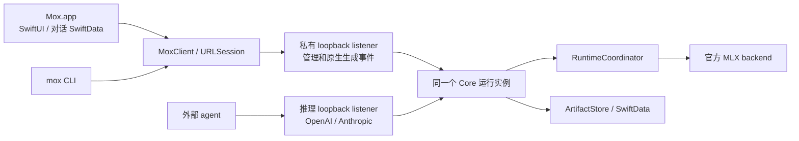

# Mox 技术设计 v1

日期：2026-09-05。状态：推荐实施方案；产品约束已确认，具体性能参数和依赖组合须通过本文验证门槛。本文不是当前代码说明，不要求兼容现有原型。

产品基线见 [ARCHITECTURE-DRAFT.md](../../ARCHITECTURE-DRAFT.md)，已知实现问题见 [审查报告](../../REVIEW-2026-09-05.md)。本文优先规定责任、数据和生命周期，再选择框架。Pi 后置；多模态确定支持，但第一版只接受文本和工具语义。

## 1. 选型结论

| 领域 | 选择 | 理由 / 不选择的方案 |
| --- | --- | --- |
| 平台与语言 | arm64 macOS，Swift 6 严格并发 | 不增加 Intel/iOS/Linux 分支。最低系统初定 macOS 15，发布前以实际依赖和最旧系统 smoke 核实；不因开发机系统较新而默认升高下限。 |
| 构建 | 完整稳定版 Xcode + SwiftPM；Xcode App/UI test targets | SwiftPM 管理库、CLI 和依赖；Xcode 负责 App 打包、资源、签名、UI 测试。不是两份业务代码。 |
| GUI | SwiftUI + Observation；必要处使用 AppKit | `@MainActor @Observable` feature state；避免一个巨大 AppState，不为简单视图强制套 MVVM 层级。Apple 官方介绍了 Observation 的依赖跟踪。[文档](https://developer.apple.com/documentation/SwiftUI/Managing-model-data-in-your-app) |
| 持久化 | SwiftData | 用户已确认；使用明确 store、隔离与保存边界。无 GRDB、无手写 SQLite 访问层。ModelContainer 管理 schema/store，ModelActor 隔离上下文。[ModelContainer](https://developer.apple.com/documentation/swiftdata/modelcontainer)、[ModelActor](https://developer.apple.com/documentation/swiftdata/modelactor) |
| 推理 | mlx-swift + mlx-swift-lm 官方产品 | 直接复用模型 factory、tokenizer、生成、工具解析和统计；不重写模型架构。 |
| HF 获取 | 官方 swift-huggingface adapter | 复用精确 revision、快照下载、cache、恢复；Mox 实现业务安装事务。[项目](https://github.com/huggingface/swift-huggingface) |
| 其他源网络 | Foundation URLSession | 原生请求、下载到文件与取消；只补源协议和官方 SDK 未覆盖的恢复要求，不先造并行 Range 引擎。 |
| HTTP server | Hummingbird 2 系列，底层 SwiftNIO | Hummingbird 提供路由、中间件和服务框架；不直接维护一大块 NIO handler。它是社区项目，不宣称 Apple 官方框架。[项目](https://github.com/hummingbird-project/hummingbird) |
| GUI/CLI client 与本地 IPC | URLSession + loopback HTTP，管理 listener 独立鉴权 | 同一 client 连接 App worker、前台服务和 Homebrew 服务；业务入口统一在 Core，不能把 transport 数量等同于业务实现数量。 |
| CLI | Apple swift-argument-parser | 类型化参数、子命令和帮助，不再手动扫描 argv。[项目](https://github.com/apple/swift-argument-parser) |
| 进程 | Foundation Process + DispatchSource 信号/父连接监测 | 原生启动进程、排空管道、退出协调；不写 C signal handler 中的 Swift 分配逻辑。 |
| 凭据 / hash / 日志 | Security Keychain、CryptoKit、Logger/OSSignposter | 原生实现；诊断结构化且默认脱敏。 |
| 测试 | Swift Testing；XCTest/XCUITest 用于 UI 自动化 | Swift Testing 测领域与异步服务；UI 使用官方 UI 测试工具，不以当前 CLT 残缺否定 XCTest。[Swift Testing](https://github.com/swiftlang/swift-testing) |

SwiftNIO 自身明确定位为低层网络组件，并建议应用使用上层框架；选择 Hummingbird 是减少自研 HTTP 基础设施的工程判断，不是保留旧 NIO 代码的理由。[SwiftNIO](https://github.com/apple/swift-nio)

候选 `swift-server/swift-http-server` 的 README 当前明确标为 work in progress，因此不作为本次默认生产依赖；以后可按实际发布状态重新评估。[项目状态](https://github.com/swift-server/swift-http-server)

依赖锁定经验证的发布版，提交 resolved 文件；不跟随 main。当前本地 MLX 0.31.6 / LM 3.31.3 是 API 研究基线，不承诺就是重写时最新或最终版本。Hummingbird 的具体 patch 与 Xcode/MLX 组合在 G0/G2 锁定。

## 2. 模块和依赖

推荐 SwiftPM targets；命名可调整，依赖方向不可反转：

```text
MoxDomain                  Foundation 值类型、业务错误、纯策略输入输出
MoxCore -> Domain          用例、ArtifactStore、RuntimeCoordinator、端口协议
MoxPersistence -> Core     SwiftData repositories；不依赖 HTTP/GUI
MoxSources -> Core         HF/ModelScope adapters；下载和 snapshot materialization
MoxMLX -> Core             官方 MLX 适配；模型资源和生成 handle
MoxServer -> Core          Hummingbird + 三个 wire adapters
MoxClient -> Domain        URLSession + 管理协议 DTO/事件消费
MoxBootstrap -> Domain     发现、锁、Process、服务启动/退出协调
mox executable            ArgumentParser；client 命令；serve 子命令组装服务
MoxApp                    SwiftUI + Client + Bootstrap + 对话 Persistence
```

Service composition root 注入 Core、Persistence、Sources、MLX、Server。App 的对话存储使用 Persistence，但不创建 RuntimeCoordinator 或 MLX backend。通过链接后产物检查保证 GUI 不拉入 MLX 重库。

`serve` 与普通 CLI 可以先处于同一二进制，依赖加载成本需测量；没有证据时不增加一套 server CLI。公开 Core 的嵌入式 SDK 暂不承诺稳定 ABI；其他软件优先 HTTP 集成。

只对替换成本真实存在的边界定义小协议：ModelSource、RuntimeBackend、任务/配置存储、Clock、ServiceClient。不要为每个 struct 建 protocol。LRU、参数解析、路径/标识校验是纯策略；它们不各自成为拥有重复状态的 actor。

## 3. 进程拓扑与所有权



服务有 foreground / appOwned / externallyManaged 三种 ownership metadata；行为实现相同。服务进程不是 root daemon，不自行双 fork，不安装 LaunchAgent。`brew services` 运行 `mox serve`；不用 sudo，不要求 GUI 安装 Homebrew。Homebrew start 管理用户级登录启动。[Homebrew](https://docs.brew.sh/Manpage)

### 3.1 为什么本次不选 XPC / Unix socket

XPC 有实质价值：系统级进程通信、peer code-signing 身份校验、App 内 XPC service 的按需启动；它不要求 root，也能用于用户级 LaunchAgent。此前将它简单表述为两套业务入口不准确：HTTP/XPC 都可以调用同一个 Core。

本次仍推荐 loopback HTTP，因为外部 API 必须存在，且 GUI-owned、前台独立启动、Homebrew 三种所有权必须连接同一实例。App 内 XPC service 本身不提供这三者的统一发现；采用命名 Mach service 要设计注册和 bootstrap domain，采用匿名 endpoint 仍要解决 endpoint 交付。Homebrew 可以通过定制服务文件配合，不能声称它不支持 XPC。增加的主要是分发/注册/身份策略和故障矩阵，不是几行方法包装。

这项取舍接受了明确限制：HTTP 管理凭据不能隔离同一用户下恶意进程。若产品要求只有指定签名的 App/CLI 能管理服务，则应优先采用 XPC 管理面 + HTTP 对外推理，重新设计用户级服务注册，而不是继续给 bearer token 打补丁。当前未提出该身份隔离需求；G2 必须验证当前三种启动方式及发现安全性。详见 [选型与竞品补充](COMPETITOR-AND-SELECTION-REVIEW.md)。[NSXPCConnection](https://developer.apple.com/documentation/foundation/nsxpcconnection)、[身份校验](https://developer.apple.com/documentation/foundation/nsxpcconnection/setcodesigningrequirement(_:))、[Homebrew 服务定义](https://docs.brew.sh/Formula-Cookbook#service-files)

Unix socket 可提供文件权限隔离，但 Foundation URLSession 没有与普通 HTTP URL 等价的直接连接入口，需要另一套 client transport。当前选择鉴权 loopback，保留 Server/Client 与 Core 的边界；不抽象一个运行时可随意切换 IPC 的平台。

### 3.2 服务发现、身份与竞争启动

- 对 canonical data root 派生实例键。跨进程 `flock` 的持有文件描述符是所有权依据，PID/端口/文件存在都不是锁。
- root 下 `run/` 目录权限 0700，discovery 文件 0600；声明 instanceUUID、PID、owner、protocolVersion、private endpoint、public endpoint 状态和随机实例级管理凭据。凭据不写日志，不以 argv 传入。
- 锁成功后初始化 store/recovery，再绑定 listener，最后原子发布 ready discovery。启动失败不留下可用声明。
- client 校验文件归属/权限、instanceUUID、协议版本、Mox identity；不接受任意 2xx 服务。管理凭据仅在 loopback 指定 origin 使用，禁止 redirect 携带。
- 随机凭据防其他用户或浏览器页面轻易访问管理 API；它不构成抵御同一用户恶意进程的安全边界。
- 竞争启动的失败者只连接已验证实例，不加载第二份模型。`mox serve` 显式启动遇到已占用 root 时返回清晰非零退出，不进入重试风暴。
- GUI 对自己的 worker 保留父子控制管道。正常退出协调关闭；父进程崩溃/管道 EOF 触发 worker 取消任务、保存状态并退出。Homebrew 模式不依赖 GUI 管道。
- 管理 listener 随机 loopback 端口；公开推理 listener 默认 127.0.0.1:11555。GUI 自启动可以先只开私有 listener，在用户开启 API 服务后绑定公开端口；`mox serve` 默认开启公开 listener。公开端口占用明确报错，不偷偷改地址。
- 外部客户端 API key 与管理 token 分离，前者可存 Keychain；管理 token 随实例轮换，仅作私有 bootstrap 凭据。外部 endpoint 要求配置 API key，GUI 提供复制连接信息。拒绝浏览器 Origin 请求，默认不开放 CORS。

独立 `.app` 和 Homebrew 安装出现版本差异时明确要求匹配发行版本/协议，不实现旧原型兼容。保留 wire version 是为了检测错误连接，不是维护历史分支。

### 3.3 关闭和取消

服务关闭顺序：停止接收新工作→拒绝/取消排队请求→取消生成并等待 backend 结束→保存下载恢复状态→保存 store→关闭 HTTP→删除己方 discovery→释放锁。

取消 GPU 工作并非瞬间完成；退出期限到达时可结束进程，但不得先发布“资源已回收”或“生成成功”。恢复时将未完成工作标 interrupted。关闭窗口不退出；退出 App 有活跃工作时提供明确用户选择。对外部/Homebrew 服务，GUI 永远不擅自终止进程。

## 4. 模型身份与 registry 契约

领域类型：

```text
RegistryID        用户配置的来源实例 ID（不等于域名）
RepositoryPath    保留路径分段的仓库名
RevisionSelector  用户给的 branch/tag/commit
ResolvedRevision  provider 确认的不可变 revision
ModelReference    registry + repository + selector + optional variant
ArtifactID        对规范化来源/revision/variant描述做摘要的稳定内部键
InstalledModelID  本地 installation UUID；API/管理动作使用此 ID 或唯一 alias
```

CLI 建议 `hf:org/repo@revision`、`ms:org/repo@revision`、`work:org/repo@revision`；具体字符转义按 provider 校验。短 `org/repo` 使用 defaultRegistry，省略 revision 由 provider 解析默认分支后固定。API model 接受本地唯一 alias 或 installation ID；冲突报错，不猜测。请求时冻结 artifact ID，之后 alias 更新不改变在途请求。

RegistryConfig：id、displayName、providerKind、origin endpoint、mirror policies、credential reference。Mirror 是同一 registry 的访问替代，不能改变来源身份；用户配置任意端点必须符合支持的 provider 协议。第一版 HF、ModelScope，加自定义同协议实例；OCI/静态 manifest 不在 v1。

`ModelSource` 是 snapshot 级接口：resolve(reference)、describeSnapshot(resolved)、materialize(snapshot, staging, operationContext)。返回相对路径、实际大小/未知标记、校验类型/值、revision、必要资产和能力线索。不能强迫所有 provider 实现相同字节传输方式，否则会失去 HF 官方 SDK 的复用。

HF 使用专属受控 HubCache + 官方 snapshot 下载路径；不删除用户全局 HF cache。初版接受下载 cache 与安装目录短期重复空间，UI 估计峰值，定期清理由本服务拥有的未引用 cache。可用系统文件 clone 优化，但不能依赖 APFS 特性保证正确性。

ModelScope 有官方 Python SDK，并已有独立的轻量 `modelscope-hub`；本次未找到官方维护的 Swift Hub SDK。选择 URLSession 薄适配是原生分发与 SDK 复用的权衡，不是因为没有 SDK。参考当前独立 Hub 实现，而非只盯旧 SDK 的兼容入口；固定参考 revision、建立响应 fixtures 与真实 Hub 集成验证，明确承担远端协议变化的维护成本。若关键语义无法可靠实现，再用证据重新评估内嵌 Python helper；不能要求用户自行安装 Python。[官方 Hub SDK](https://github.com/modelscope/modelscope_hub)

文件选择由模型格式 inspector 给出：权重/index、config、tokenizer、chat template 及 processor 资产；不下载整个仓库所有训练文件，也不把必要多模态配置永久排除。不支持/不完整的布局明确失败，不能假定 config.json 存在就能运行。

## 5. 安装与更新事务

```text
created → resolving → downloading ⇄ paused
                    → verifying → committing → installed
各非终态 → failed / cancelled / interrupted
```

持久任务包括 operationID、snapshot plan、每文件恢复句柄/validator、累计 bytes、状态、错误。进度未知用 optional total，不用 0 假装已知；以已验证字节计算，恢复时与实际文件核对。

原子安装：

1. 固定 revision，检查磁盘空间，创建同文件系统 staging。
2. source materialize 下载到 staging/cache；取消保存可用恢复信息，删除是独立 discard 操作。
3. 校验相对路径、资源长度、期望 digest、必要资产、config/weight index 一致性。严格区分服务端内容 digest、Git blob ID 和 opaque ETag；不把本地新算 hash 当作远端完整性证明。
4. 写可重建的 artifact manifest；标为 prepared。manifest 包含来源、文件目录、digest/provenance、schema version 和变体描述，不含凭据。
5. 将 staging 原子 rename 到按 artifact ID 命名的最终目录，随后提交 SwiftData 安装记录/alias 更新。
6. 已安装快照不可原地更新。旧版引用计数和 request lease 归零后才 GC。

数据库保存与 rename 不构成一个事务：崩溃后扫描 prepared manifest 修复“文件已提交、索引未提交”；“索引在、文件缺”标 missing，不能显示 ready。已有快照一律不覆盖。

下载器规则：优先系统 downloadTask/SDK；resumeData 是恢复优化，不保证任意崩溃后一定可续。下载暂停恢复、服务重启和远端改变必须验收；不成立时从已完成文件继续，对失效 partial 明确重下。需要手动 Range 的 provider 才做单流校验实现，检查 200/206/416、Content-Range 与 validator，分块写/hash，无大 Data 预分配。Apple 提供 downloadTask resume 入口，但 Mox 仍负责业务恢复语义。[Foundation](https://developer.apple.com/documentation/foundation/urlsession/downloadtask(withresumedata:))

引用导入保留 bookmark/路径、文件指纹和 external ownership。移除不删外部文件；加载前验证存在和未被修改。用户改写外部目录时不能保证不可变，需拒绝冲突或重新注册；显式复制可转为托管 snapshot。

## 6. RuntimeCoordinator 与官方 MLX

一个 Coordinator actor 是资源状态的唯一权威；其中每个 slot：artifact ID、state、load Task、backend handle、reserved bytes、active leases、pinned、LRU tick。不要另建 metadata actor 持有另一份 resident set。

```text
absent → reserving → loading → warming → ready → unloading → absent
                 任一失败 → rollback → failed
```

首次加载：先在本 actor 内发布 loading task，再 await；同一 artifact 的请求共享 task。等待者取消只取消自己的等待，不取消其他等待者需要的 load。loader/warmup 失败回滚 reservation，释放资源，向所有等待者返回明确错误。

生成持有 request lease，直到 backend generation task 真正结束且 GPU 工作已完成。lease 按唯一 request ID 释放一次；unload 是可等待的操作。固定表示禁止自动卸载，不阻止用户显式卸载；使用中显式卸载返回 busy，除非用户明确要求先取消任务。

### 6.1 内存和并发策略

- 初版单 GPU 工作队列：同一时刻一个 load/warmup/generation 高峰任务；可以驻留多个模型。网络下载、HTTP、GUI 保持并发。这是可预测的初始策略，不是 Swift actor 自动串行保证。
- 初始队列容量 8、等待期限 60s，可配置并在 health 报告；具体数值是待真机校准默认，不宣称最优。排队前验证模型/参数/体量，公平 FIFO；取消立刻移除等待者。
- 预算区分驻留 weights、KV/工作区、加载峰值、系统 reserve；不能只用磁盘大小，更不能把 GPU cache budget 当 weights budget。
- 自动预算参考 Metal 设备建议 working set、物理内存、当前压力以及模型 config 估算，取保守可用值；将估算和实测分开显示。估算未知时保守拒绝或要求明确限制，不以一个硬编码 4GB 代表任意模型。
- 加载前淘汰 idle/unpinned，确认实际释放后再使用额度；处理系统内存压力时优先清理空闲资源。MLX 全局 memory/cache/wired limit 只由 backend 配置，不在各请求争抢设置。
- 首版不强行实现 continuous batching。以后增加并发执行策略要通过相同 lease/budget 契约；不影响协议层。

### 6.2 MLX 适配规则

本地已解析上游 `ModelContainer` 有 prepare/generate，`Generation` 有 chunk/toolCall/info，info 含真实 token、prefill/decode 时间和 stop/length/cancelled。应直接映射，不再自己按字符数估算。

上游 `Chat.Message` 的字段未必覆盖工具 ID、内容块顺序等全部领域语义；adapter 必须按实际 processor 使用 UserInput/messages/tools，不能因为 convenience API 更短就丢工具信息。官方 parser 优先，模型不支持工具时拒绝，不靠模型名称包含 Qwen 等字符串猜测能力。

用有 generation Task handle 的上游路径落实 cancel-and-wait；仅仅丢弃 UI iterator 不算取消完成。当前上游生成流本身可无界缓冲，不能声称一个外层 bounded AsyncStream 自动修好了背压。G3 必须验证积压边界：持续排空上游到有界输出队列，超限取消 producer 并失败，不丢 chunk；若此路径无法限制内部积压，改用可控官方迭代入口，仍复用官方算法，不重写采样/kernel。

初版不引入跨请求 prefix cache。每次发送完整有效上下文，保证结果可解释；结构保留模型 revision/参数/tokenizer identity，为后续 cache key 提供条件。官方 cache API 存在不等于共享缓存已经安全。

## 7. 请求、消息、多模态与事件

示意领域契约（不是承诺可以直接编译的公开 API）：

```text
GenerationRequest
  requestID, installedModel/alias
  input: conversation([Message]) | rawPrompt(String)
  sampling, outputLimit, stopSequences, tools, toolChoice

Message
  role, orderedContentBlocks

ContentBlock
  text | toolCall(id, name, arguments) | toolResult(callID, content, isError)
  后续 media(AssetReference, mediaType, presentationOptions)

ResolvedGenerationRequest
  immutable artifactID, normalized input, effective parameters + provenance
  validated model capability, budget/deadline, requestID
```

多模态从设计上保留 ordered blocks、AssetReference、输入/输出 capability；第一版不实现虚假的 audio/video provider。AssetReference 是服务可解析的资产 ID/元数据，不让外部请求直接指定任意本地文件路径。后续 image 输入通过资源导入边界转为 CIImage，视频用 AVFoundation、音频按上游支持另行接入。媒体下载/解码预算独立，不能把大 base64 塞入 SwiftData 或日志。

参数优先级：显式请求 > 模型设置 > 有效全局设置 > 产品默认。单次解析后冻结；GUI 和 CLI 请求沿相同规则。初始 max output 默认 2048，服务上限建议 8192，但同时受模型 context 和预算限制；这些是产品默认而不是所有模型能力。temperature/topP 等做有限数与范围验证，未知/不支持的语义参数明确拒绝。

工具 schema 保留 JSON 结构、调用 ID 和消息角色；工具执行不在 Mox 推理服务内发生。外部 agent 返回 toolResult 后再发下一次生成。

事件：

```text
accepted(requestID, sequence, resolvedModel)
queued / loading / prefill
contentDelta(blockID, text)
toolCallStarted / toolArgumentsDelta / toolCallCompleted
usage(promptTokens, outputTokens, timings)
finished(stop | length | toolCalls | cancelled)
failed(code, safeMessage)
```

每请求序号递增，只出现一个语义终态。transport 中断由 client 归类 connectionLost，不能等同 finished。API consumer 断连取消该生成；持久下载 operation 与观察连接分离，断开进度页面不自动删除任务。

生成会话 handle 提供事件消费、cancel、waitUntilStopped。采用结构化 task ownership；不暴露一条无错误、无完成信息的 AsyncStream<String>。生产事件不丢，慢消费者超过有界缓冲/写超时明确失败。UI 可合并刷新，不能丢掉持久消息内容。

## 8. HTTP 和 CLI 契约

私有管理 listener（示例路径）：

- GET `/mox/v1/state`：实例、模型、任务、有效配置概况；支持状态版本。
- POST `/mox/v1/downloads`，POST `/downloads/{id}/pause|resume|cancel`，GET `/operations/{id}`。
- POST `/mox/v1/models/{installationID}/load|unload`，DELETE installation；使用 UUID 路由避免仓库斜杠歧义。
- POST `/mox/v1/generations`：原生事件流；POST `/generations/{requestID}/cancel` 幂等。
- PATCH 配置：携带 expected revision，冲突返回 409；业务设置由服务唯一写入。
- events：客户端重连先读 snapshot，再消费变更；缓冲溢出通知 resync，不承诺无限 event replay。

公开推理 listener：`/v1/models`、`/v1/chat/completions`、`/v1/messages`，加最小 health。第一版不实现 legacy completions/Responses API/embeddings；不因路由名字存在就返回看似支持的空结果。内部 rawPrompt 是独立语义，可留到具体入口需要时实现。

公开支持范围：文本多轮、system、流式/非流式、正确 sampling/max_tokens/stop、工具定义/选择/往返、真实 usage 与停止原因。模型能力限制仍可拒绝 tools；不承诺任意 MLX 模型都能用于任意 agent。OpenAI/Anthropic wire DTO 各自独立，在 boundary 映射到领域请求。

外部 agent 集成验收必须记录该客户端实际使用的协议和端点；不能把 Chat Completions 可用等同于所有客户端（包括需要 Responses API 的配置）可用。新增端点由实际需求决定，不能悄悄降级请求。

错误类与状态：输入/不支持语义 400，认证 401/403，未安装 404，状态冲突 409，body 超限 413，队列满 429，runtime unavailable 503，意外内部错误 500；内存单任务无法容纳使用明确 resource_exhausted code 和稳定映射。SSE headers 发出前做可完成的验证；发出后使用该协议错误事件，不再写第二个 HTTP 响应。

所有 body 限制在聚合之前执行，初值 16 MiB 文本请求；SSE 写入 await 完成并最终 flush/end。每条长请求登记 task 并在 disconnect 取消；shutdown/drain 全部可等待。协议序列必须按官方规范和真实 SDK fixtures 验证，此文的领域事件不替代 wire spec。

CLI 产品建议：`pull/list/show/remove/load/unload/chat/serve/status/config/doctor`。`--json` 输出稳定机器对象；人类输出不被 GUI 解析，stderr 保留诊断，失败非零退出。GUI 共用用例和错误码，不 subprocess 每一轮 ask。CLI 无服务时短操作可拉起临时服务执行并关闭；已有服务直接连接。可保留 CLI 会话期间 worker，避免多轮重复加载。

## 9. SwiftData schema 与配置

两个 store，分别唯一逻辑所有者：

1. RuntimeStore（服务）：RegistryRecord、InstallationRecord、AliasRecord、DownloadOperationRecord、DownloadFileRecord、ModelSettingsRecord、RuntimeSettingsRecord。
2. ConversationStore（App）：ConversationRecord、MessageRecord、ContentBlockRecord、GenerationAttemptRecord、AttachmentRecord。

属性：显式 UUID、状态枚举编码、created/updated 时间、schemaVersion；工具 arguments 用受控 Codable JSON payload，媒体本体存文件。消息顺序用 sequence，重试创建新的 attempt/分支引用，不覆盖原结果。SwiftData record 不能跨 actor/IPC；业务读取返回 Sendable snapshot。

各 store 用单独 ModelActor 管理写入；创建地点与执行器验证，不能只写 actor 就认为昂贵工作不会在主线程发生。GUI 的 @Observable state 消费 store snapshots 和 generation events。简单展示可在受控主 actor 使用 SwiftData，但不在 View 中启动下载或 GPU 工作。

autosave 不用于业务完成保证：安装状态、终态、配置等明确 save；流式文本初始每 250ms 或累计 8KiB checkpoint 一次（待性能校准），终态立即保存。崩溃可能丢最后一次 checkpoint 后少量文本，应显示 interrupted；不宣称逐 token 持久化。

使用 VersionedSchema/SchemaMigrationPlan 作为发布后演进机制，当前第一版只建干净 V1。启动 store 失败明确报错，不删除用户对话、不回退空库。备份走应用导出/受控 store 关闭后的完整备份，禁止运行中只复制单个底层 sqlite 文件。

配置：SwiftData 中持久设置为权威；启动 flags > MOX_* 环境 > 持久设置 > 默认，形成只读 EffectiveConfig（每字段 provenance）。临时覆盖不回写；`config set` 经管理接口更新。JSON 导入/导出只作显式交换格式，不同时监听第二份配置文件。显示被启动参数覆盖的设置，避免 UI 显示保存成功却不生效。

路径建议：

```text
~/Library/Application Support/Mox/
  runtime/            SwiftData RuntimeStore
  conversations/      SwiftData ConversationStore
  models/             managed immutable artifacts + staging
  source-cache/       仅本产品拥有的 provider cache
  attachments/        对话媒体文件（后续）
  run/                lock / discovery（临时状态，可清理）
```

模型 root 可配置；迁移目录为显式带进度操作，不因改文本路径就移动。Keychain 保存长期凭据，锁定/拒绝访问时返回可恢复错误，Homebrew 启动不可静默降级明文存储。

## 10. GUI、分发与诊断

2026-09-06 用户澄清：0.1 是本机原型验收，App 本地构建仍需完成；下述公开签名、公证、Homebrew 分发要求延后到 P1。Pi 后置；不要求 Codex 或 Responses。

GUI feature state：Models、Downloads、Chat、ServiceConnection、Settings、Diagnostics；共享依赖由 App composition 注入。SwiftUI NavigationSplitView、Settings scene、MenuBarExtra、原生文件选择；仅系统集成缺口用 AppKit。初版基础 Markdown 可用系统 AttributedString 能力，复杂代码渲染后续按实际需要引库。

服务连接状态与模型就绪状态分开：connecting/running/unavailable 不等于 unloaded/loading/warming/ready。无模型服务可以健康；指定模型 warmup 成功才 ready。重连恢复 snapshot，不自动重放 generation；聊天重试由用户触发。

分发：Xcode 生成 arm64 `.app`，内置同发行版本 `mox` worker 及所有 MLX Metal/resource bundles。使用 bundle-relative 定位，不能依赖开发机 `.build` 或 PATH。独立 App 不要求用户安装 Node/Python/Homebrew。Homebrew formula 交付 CLI + service，cask 可分发 App。

公开分发阶段 P1 选择 Developer ID 签名、Hardened Runtime、公证的站外分发；不以 Mac App Store sandbox 为目标。理由是共享用户级服务、可配置模型目录与 Homebrew 共存；不额外申请管理员权限。GUI 拥有父子 worker 不等于系统 sandbox。最小系统、Keychain、外置卷、签名资源和干净账户首次启动都必须验证。[Apple 公证流程](https://developer.apple.com/documentation/security/notarizing-macos-software-before-distribution)

日志：一个 subsystem、按 storage/download/runtime/server/gui/process 分类，结构化记录 operationID/requestID/instanceID/artifactID。Logger + OSSignposter 记录排队、下载、load/warmup、prefill/decode、取消回收；模型输出统计从上游 info 来。默认不记录 prompt、tool arguments、token、认证和可泄露凭据的 URL。

诊断导出由显式动作触发，包含版本/依赖/硬件/有效配置脱敏/任务状态/近期关联事件。Unified Logging 是主要 sink；为 GUI 日志页提供有界脱敏事件 ring 和 snapshot，磁盘持久诊断按受控导出实现，不承诺可从系统日志读取任意历史。服务与 GUI 重启后的问题由 OS 日志和持久任务终态辅助定位。

## 11. 验证门槛与重写阶段

2026-09-06 更新：实际交付顺序以 [发布计划](../RELEASE-PLAN.md) 的 M1–M4 为准；下表是验证维度，不是要求重做一轮前置预研。Xcode/SwiftData 与新骨架已通过验证，后续 Metal、App 与 MLX 验证随实现进行。

| 门槛 | 验证内容 | 完成标准 |
| --- | --- | --- |
| G0 工具链 | 完整 Xcode、SwiftData headless、App 资源打包 | 独立进程写入→新进程重开；GUI smoke；MLX Metal 资源可定位。 |
| G1 领域/存储 | 参数解析、状态机、SwiftData 保存/恢复 | 真实 repository 路径；故障不清空数据；配置冲突可检测。 |
| G2 transport/进程 | Hummingbird、URLSession SSE、锁/发现/退出 | 竞争启动只有一个 owner；慢读、断连、超限、零输出和同连接下一请求均正确。 |
| G3 MLX | 本地小模型 load→warmup→stream→cancel→generate again | 真 token/stop reason；cancel-and-wait；有界输出与 lease 回收；无需外网也可运行已安装模型。 |
| G4 获取 | HF/ModelScope 真仓库 + 可控 HTTP 故障服务 | 精确 revision、完整资产、暂停恢复、validator 变化、空间不足和提交崩溃恢复。 |
| G5 GUI 闭环 | 全新用户安装、下载、聊天、保存、重启 | 不用终端；失败可诊断；Service 和 Chat 状态不混淆；UI 测试真实 client。 |
| G6 API 闭环 | OpenAI/Anthropic fixtures + 真实客户端 | 流式、usage、工具往返、错误和取消；记录支持的具体客户端配置。 |
| G7 发布 | App + Homebrew | 干净账户独立安装、启动、退出、并存冲突、签名/公证/升级诊断。 |

执行顺序：先 G0 风险验证，再建立干净模块骨架；G1/G2/G3 完成可运行本地模型链路，然后 G4/G5，最后补齐 G6/G7。每阶段删除被替换旧代码，不保留永久双实现；无需等整个新架构完工才做真机验证。另一 AI 的实现任务在切换前协调，不能覆盖未提交文件。

Swift Testing 测纯策略/服务；真实 HTTP server 测 framing/backpressure（仅 mock encode/decode 不算）；小模型 smoke 在 arm64 runner 受控执行。XCUITest 覆盖首次启动、断连、取消和会话保存。测试资源不使用真实用户目录，端口动态分配，Clock 可注入；不把生产增加 registerBatch 等测试专用分支作为可测性。

初版每次基准记录硬件、OS、依赖 revision、模型 artifact、cold load、TTFT、prefill/decode tokens/s、峰值内存、取消至资源回收时间；相对基线回归需解释，不设置跨机型虚假的统一性能数字。没有测量就不声称优于竞品。

## 12. 2026-09-05 历史核验结果

以下为重写前研究记录，非当前阻塞。2026-09-06 完整 Xcode 26.6 与 SwiftData probe 已通过；最新进度见 HANDOFF。

- 本地研究基线：Swift 6.3.3，arm64 macOS 26.6.2；active developer directory 为 `/Library/Developer/CommandLineTools`。
- 本地 MLX 源码确认：ModelContainer.prepare/generate、Generation.info/toolCall、生成任务取消与同步结束；UserInput 已含 image/video。不能把这些能力标成“上游不存在”。
- HF SDK 本地 `HubClient+Files.swift` 确认 downloadSnapshot、受控 HubCache、partial/resume 的路径；这些 API 存在不等于 Mox 的整个下载恢复验收通过。
- 已创建最小 SwiftData headless probe 并尝试编译；编译器报 `SwiftDataMacros ... plugin ... not found`，因此没有执行到写入/重开步骤。未发现默认 `/Applications` 下 Xcode App。该问题是 G0 环境阻塞，未证明 SwiftData 运行语义失败；不因此换库。
- 本轮没有修改 Package.swift 或 Sources，没有安装依赖、启动模型服务、下载权重，也没有运行全量测试。
- 仍需 G0/G2/G3 实验确认：完整 Xcode 的 SwiftData、Hummingbird 实际流式/取消行为、官方 MLX 结束等待与缓冲限制。实验不通过就针对证据调整适配路径，不靠文档承诺跳过。

具体产品决策已足够，不需要用户继续指定类/协议。以上少量工程默认（双 listener、外部 API key、GPU 初始串行策略、macOS 15 下限）是本方案推荐，实施时按验证结果更新并记录理由。

## 13. M1 实施核验（2026-09-06）

本节细化 §6/§7 在 M1 的实际边界，不增加 M2 范围。

- 锁定官方 `mlx-swift 0.31.6`、`mlx-swift-lm 3.31.4`；tokenizer 使用 Hugging Face `swift-transformers 1.3.3` 的本地 `AutoTokenizer.from(modelFolder:)`，用小适配器实现 MLX 的 TokenizerLoader/Tokenizer 协议。CLI 使用 Apple ArgumentParser 1.8.2。完整传递依赖 revision 以根目录 `Package.resolved` 为准。MLX 依赖要求 Swift 6.3，产品部署目标仍是 macOS 15；尚未在 macOS 15 真机测试。
- LM 3.31.4 的 `Evaluate.swift` 中 `generateLoopTask` 仍创建无界 AsyncStream。M1 使用同文件官方 `generate(input:parameters:context:didGenerate: (Int) -> GenerateDisposition)`，没有自行实现 token 迭代、采样或 EOS。该入口已被上游标 deprecated；这是为满足有界输出所做的明确选择，升级时重新核验。回调直接写入 Core 有界队列；上游只保存至多 maxTokens 个 token ID，没有另一条异步文本队列；文本解码复用官方 tokenizer；增量边界由 ScalarStreamingDecoder 按 Unicode scalar 计算，保留至多 maxTokens 个 token ID。锁定版本 NaiveStreamingDetokenizer 按 grapheme 数量计算差值，会漏掉跨 token 组合符号，故不再使用。未完成 UTF-8 序列延迟输出，正常终态 flush；若 tokenizer 改写已发前缀则明确失败，不丢文本后成功。官方同步循环及适配器返回前均调用 `Stream().synchronize()`。
- GenerationHandle 仅有一个消费者，队列上限 128 个非终态事件、256 KiB 文本，另保留一个终态槽。溢出立即请求停止，实际 GPU 完成后发 `failed(slowConsumer)`；保留已有事件，不把丢 chunk 当成功。取消在同一锁下幂等化；句柄拥有任务，wait 等任务返回和 lease 回收。
- Coordinator 显式 FIFO GPU 门闩覆盖 load/warmup/generate/unload，actor 可重入不等于 GPU 串行。加载任务与单个等待请求的取消隔离；同批共享加载失败，后续新批次可重试。每个 request ID 只有一个 lease；使用中卸载 busy，shutdown 先取消并等待请求和在途卸载。M1 所有驻留模型均未固定，无 pin 命令。
- 本地引用做规范化、路径摘要 ID、config/tokenizer 存在性、safetensors 有界头/尺寸/分片索引校验；加载前后检查资产大小/修改时间指纹；同一路径的新引用不得静默复用旧驻留对象，需先卸载。tokenizer.json 有 64 MiB 元数据预算上限。引用不写文件，不承诺防御其他进程并发改写，也不把该指纹当密码学来源证明。模型需要本地 chat template，禁止上游缺模板时的 stdout 降级提示和隐式串接。
- M1 可估算的 dense attention 配置类型：qwen2/qwen3/llama/gemma/gemma2/gemma3_text/mistral/phi3；其他类型即使 factory 认识也明确拒绝，待有对应内存估算再扩展。当前真机证据仅覆盖 Qwen2.5 0.5B 4-bit，非全模型兼容声明。
- 预算独立估计：驻留 weights=权重资产字节；加载额外峰值再预留一份 weights；KV 按层数×2×KV heads×head dim×4 bytes×token 预算；工作区根据 hidden/vocab/layers 和固定 128-token prefill 分块保守估计，并设 64 MiB 下限。未知/溢出维度拒绝。tokenized 输入上限 8192、原始文本安全上限 1 MiB，输入+max output 还必须符合模型 context；超限拒绝而不截断。
- 静态总预算取物理内存 65% 与 Metal recommended working set 80% 的较小值；GPU 准入时再读取 macOS free+inactive pages，额外留 20% 余量，必要时淘汰空闲模型。估算不是内存硬隔离，其他进程可能在准入后增加占用。backend 在组合入口一次设置 MLX memory limit 和 64 MiB cache limit；Coordinator 才是业务资源权威。不修改 wired memory，也不运行跨请求 prefix cache。
- CLI 的 stdin 使用非阻塞读与 DispatchSourceRead，迟到读就绪事件遇 EAGAIN 保留等待；stdout 采用非阻塞写入和 5 秒写入期限；SIGPIPE 转为诊断退出。stderr 为非阻塞、尽力写入，满管道允许丢诊断行，完整阶段事件使用 Unified Logging；不允许为了诊断阻塞 GPU 回收。正常回复只到 stdout。ArgumentParser 的默认参数退出码 64 在组合入口映射为规格要求的 2。终端输入超出 1 MiB 或读取失败通过 throwing continuation 传播，协调关闭并退出 1；仅正常 EOF 返回 nil。
- `scripts/build-m1.sh` 用完整 Xcode 编译 Metal，把官方资源库以 `mlx.metallib` 与可执行文件并置，同时携带资源 bundles；这是上游 device.cpp 明确支持的定位路径。`swift build/test` 单独不会编译 Metal；真实测试通过 `scripts/test-m1-real.sh` 放置该资源。开发机额外安装了 Apple Metal Toolchain 17F109，非产品运行时依赖。

核验来源：[MLX 发布版](https://github.com/ml-explore/mlx-swift/releases/tag/0.31.6)、[LM 发布版](https://github.com/ml-explore/mlx-swift-lm/releases/tag/3.31.4)及对应锁定 checkout 源码。实际通过范围与复现证据见 [M1 验收报告](../acceptance/M1.md)。
